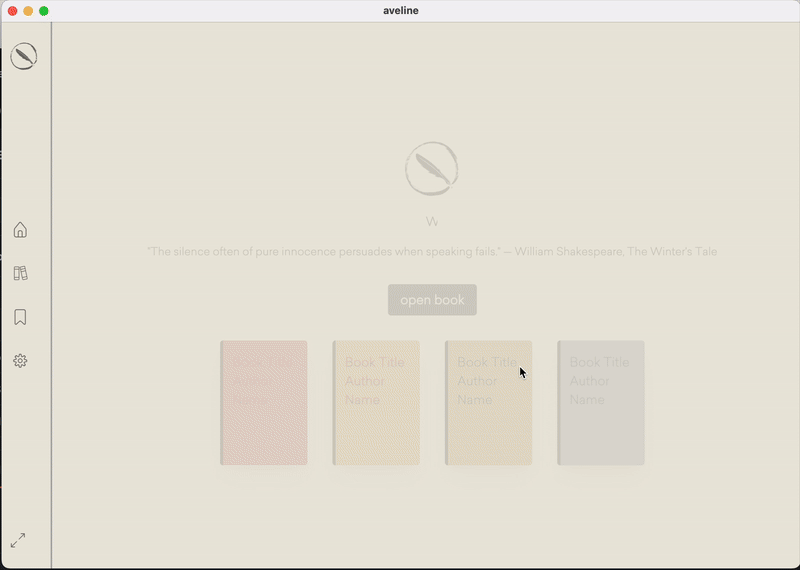

# Aveline

Aveline aims to be a simple, minimalist ebook reader application, enhanced with AI-powered tools to provide an immersive reading experience. 

Development is ongoing, with periodic updates and feature enhancements.

## Short Term Features

### **Books:**
- Read EPUB files with ease.
- Enhance reading experience with optional ambient or background music.
- Customize the interface and reading preferences to suit personal preferences.
- Track reading progress, navigate through chapters, and add bookmarks and notes for a personalized experience.

### **Audibles:**
- Convert EPUB files into audiobooks with AI narration.
- Choose ambient or background music for a more immersive audio experience.
- Keep track of your progress, navigate easily, and add bookmarks and notes to your audiobooks.

## Long Term Features
- Extend file format compatibilities.
- Enhance reading experience using AI to automatize ambient or background music based on the content.
- **Social Interaction:**
  - Share specific book libraries with friends and see their reading progress and highlights.
  - Engage with friends by sharing thoughts, annotations, and recommendations.

## Screenshot

