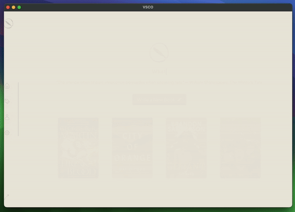

VSCO is a research project aimed at providing a modern software alternative for writing books.

It intends to offer a comfortable user experience and incorporate current tools, trends, design patterns, and features.

Currently, the project is in its early stages, working towards developing a basic prototype, with updates being rolled out periodically.



## Structure
There are two projects within VSCO:
- **vsco-app:** The main application, built with Electron and React for the renderer layer.
- **vsco-editor:** The editor component, integrated into the application as a package, and based on React.

## Steps to run the project

## 1. Build the Package

Navigate to the **vsco-editor** Directory:

```bash
cd vsco/vsco-editor
```

Install Dependencies:

```bash
npm install
```

Run the build script to compile the TypeScript code and generate output files:
This will generate the built files in the dist directory.

```bash
npm run build
```

## 2\. Link the Package Locally

Link the **vsco-editor** package locally so you can use it in **vsco-app**:

Create a global symlink for the package in **vsco-editor** directory:

```bash
npm link
```

To watch for changes and rebuild the vsco-editor package during development:

```bash
npm run dev
```

## 3. Setup the application

Navigate to the **vsco-app** Directory:

```bash
cd ../vsco-app
```

Install Dependencies:

```bash
npm install
```

Add the globally linked **vsco-editor** package to **vsco-app**:

```bash
npm link vsco-editor
```

Run Development Server for **vsco-app**

```bash
npm start
```

All done!
